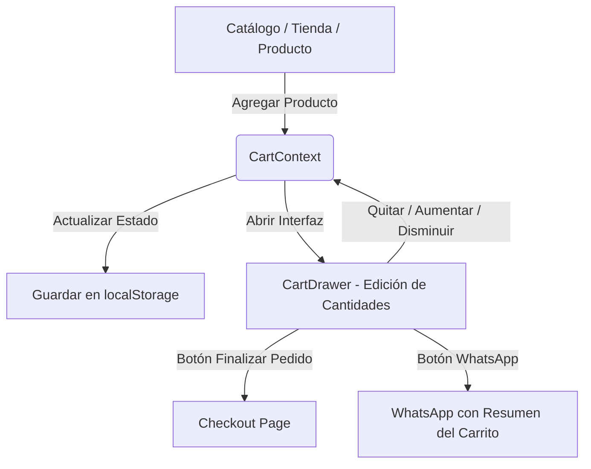

# Arquitectura de Flujo de Carrito y Checkout (Luma Commerce OS 2.0)

Este documento describe técnicamente el ciclo de vida del carrito de compras, la persistencia local, las reglas comerciales de cálculo de totales en checkout y el flujo de guardado en la base de datos local CSV.

---

## 1. Ciclo de Vida del Carrito de Compras

El sistema de carrito se compone de tres piezas fundamentales:
1. **Cart Context (`CartContext.tsx`)**: Proveedor de estado global reactivo que expone la lista de `CartItem[]` y las acciones CRUD.
2. **Local Storage**: Persistencia pasiva. Cada cambio en el estado del carrito se escribe automáticamente en la llave `luma_cart` del navegador.
3. **Cart Drawer (`CartDrawer.tsx`)**: Interfaz móvil y de escritorio deslizable que permite modificar unidades en tiempo real.



### Regla de Evitación de Hydration Mismatch
Para asegurar que Next.js compile y renderice de forma segura sin generar advertencias de discrepancia entre cliente y servidor, el `CartContext` implementa el siguiente patrón:
```typescript
const [cart, setCart] = useState<CartItem[]>([]);
const [isLoaded, setIsLoaded] = useState(false);

useEffect(() => {
  // Solo se ejecuta en el cliente tras el montaje inicial
  const storedCart = localStorage.getItem("luma_cart");
  if (storedCart) setCart(JSON.parse(storedCart));
  setIsLoaded(true);
}, []);
```
Esto asegura que el servidor dibuje el mismo estado base que el cliente recibe por primera vez (un carrito vacío), y la hidratación de datos reales ocurre asíncronamente en el cliente.

---

## 2. Configuración y Desglose Financiero en Checkout

El checkout lee de forma reactiva la lista de productos del carrito y aplica las constantes de [`commerce.ts`](file:///F:/Luma%20Commerce%20OS%20Tiendas%20Multinicho/SaaS%20Comercial%20Replicable/CRM%20En%20Sheets%20-%20copia/crm-admin/src/config/commerce.ts):

* **Subtotal**: Sumatoria de los precios de productos por sus respectivas unidades.
* **Impuesto (ITBIS - 18%)**: Calculado sobre el Subtotal (`subtotal * 0.18`).
* **Delivery**:
  * Si el método es **Retiro en Tienda**: RD$ 0.
  * Si el método es **Delivery Coordinado** o **Ruta Local**:
    * Si el Subtotal es igual o mayor a RD$ 3,000 (umbral configurable): RD$ 0 (Envío Gratis).
    * De lo contrario: RD$ 250 (costo base configurable).
* **Total**: Subtotal + Impuestos + Delivery.

---

## 3. Estructura de Datos en Leads.csv

Cuando el cliente confirma el pedido, se realiza un `POST` al endpoint `/api/leads` con la siguiente estructura JSON:

```json
{
  "id": "LEAD-1716654210000",
  "fecha": "2026-05-25",
  "nombre": "Juan",
  "apellido": "Pérez",
  "whatsapp": "809-555-4321",
  "email": "juan.perez@example.com",
  "provincia": "Santo Domingo",
  "municipio": "Distrito Nacional",
  "direccion": "Calle Dr. Delgado No. 20",
  "referencia": "Esquina Av. Independencia, frente al Palacio Nacional",
  "notas": "Llamar antes de entregar",
  "deliveryMethod": "delivery_coordinado",
  "googleMapsUrl": "https://maps.google.com/?q=18.4735,-69.9021",
  "itemsJson": "[{\"productId\":\"prod-02\",\"slug\":\"shampoo-hidratante-premium\",\"name\":\"Shampoo Hidratante Premium\",\"category\":\"Hidratación\",\"price\":1100,\"quantity\":2,\"sku\":\"SH-HID-PREM\"}]",
  "itemsSummary": "Shampoo Hidratante Premium x2",
  "subtotal": 2200,
  "tax": 396,
  "delivery": 250,
  "total": 2846,
  "canal": "tienda_online",
  "fuente": "tienda_capilar",
  "origen": "tienda_capilar",
  "utm_source": "google",
  "utm_medium": "cpc",
  "utm_campaign": "promo_verano",
  "utm_content": "ad_image_1",
  "utm_term": "cabello hidratado",
  "estado": "Nuevo"
}
```

El validador de la API escribe estos registros ordenadamente en [`data/luma_route_os/Leads.csv`](file:///F:/Luma%20Commerce%20OS%20Tiendas%20Multinicho/SaaS%20Comercial%20Replicable/CRM%20En%20Sheets%20-%20copia/crm-admin/data/luma_route_os/Leads.csv) escapando correctamente las comillas y saltos de línea para mantener la integridad de los campos JSON serializados.
El sistema soporta una migración automática en caliente de `Leads.csv` si el archivo existente fue creado en una versión previa que no contenga la columna `googleMapsUrl`.

